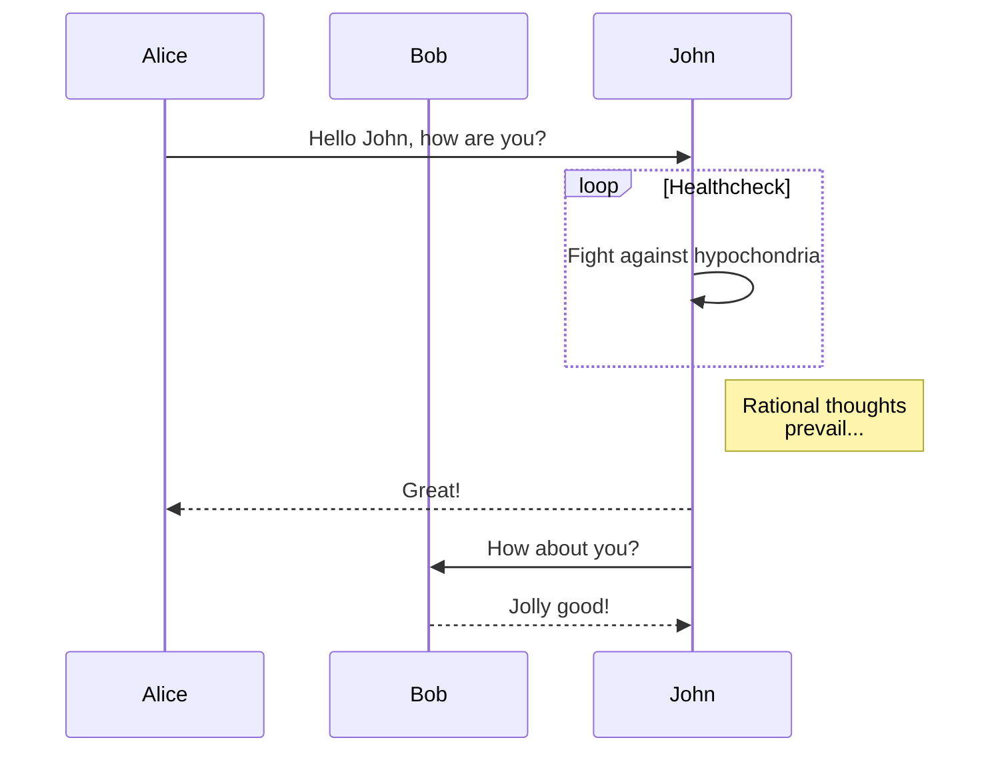
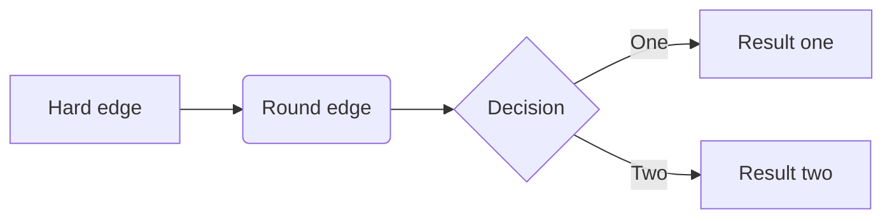
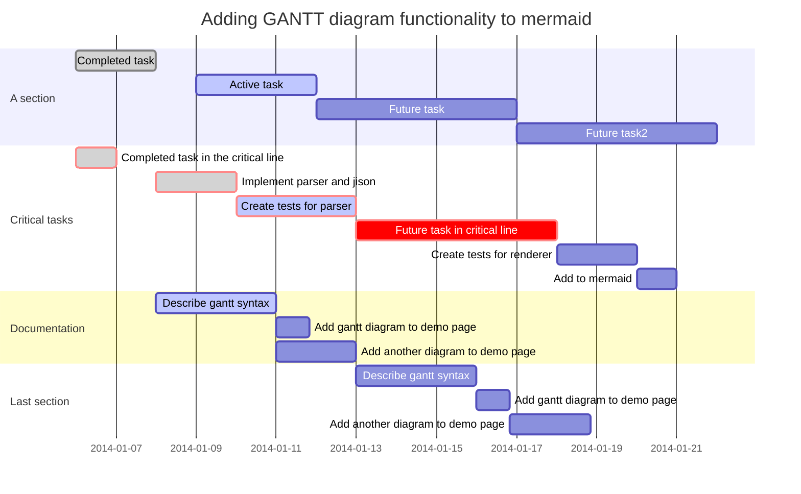

# 0X00. 前言

Blog系统其实有很多包括sina、简书等平台Blog系统，也有基于主机自己搭建的Wordpress等CMS系统。知道github后就选用了github的静态站点服务，现在本Blog就是承载在github.io上。

静态站点生成和Blog文章管理，本人接触到的主要是Jekyll和Hexo，Jekyll大概是在两年前用了一段时间，但觉得学习曲线陡峭，同时也发现了Hexo相对友好且容易上手，所以选用了Hexo作为静态网站的管理工具。

网上有很多关于Github的静态站点服务和Hexo教程，本文就不赘述，本文主要记录Markdown及Hexo插件的一些安装和使用小技巧。关于Github静态站点服务和Hexo建议查看官方文档：

Github Page服务：[https://pages.github.com/](https://pages.github.com/)
Hexo Doc：[https://hexo.io/docs/](https://hexo.io/docs/)

# 0X01. 关于Markdown

Hexo的所有文章都是使用Markdown作为标记语言生成的，Markdown作为标记语言可以用任何文本编辑工具编辑。在这过程中我使用过很多markdown的编辑器，包括利用插件实现的VIM的版本、Atom的版本，最后还是使用了Typora，很容易上手的一个markdown编辑器。
安装和下载的地址：[https://typora.io/](https://typora.io/)

##  1. Pandoc
Pandoc插件提供了文档的各种格式的输出功能，如果你需要保存文档至其他格式，包括PDF、Word、Html等等开源格式。
下载和文档地址：[http://www.pandoc.org/](http://www.pandoc.org/)

##  2. Mermaid

Mermaid，本人觉得是Markdown中最牛逼的插件没有之一。以下是实现的一些示例





还有复杂的甘特图：


文档地址在：
[https://support.typora.io/Draw-Diagrams-With-Markdown/](https://support.typora.io/Draw-Diagrams-With-Markdown/)

Mermaid的实现满足了工作中大部分需求。

# 0X02. 关于Hexo配置及插件
## 1.设置标签和分类目录
本配置都是在根目录下的_config.yml文件中修改：
```sh
      source_dir: source
      public_dir: public
      tag_dir: tags
      archive_dir: archives
      category_dir: categories
      code_dir: downloads/code
      i18n_dir: :lang
      skip_render:
```

## 2. Theme

本人选择的是主题[Next](https://github.com/theme-next/hexo-theme-next),大家一致觉得比较高质量的主题,在这主题下有4个子主题,笔者采用了Mist.

```sh
   $ cd hexo
   $ git clone https://github.com/theme-next/hexo-theme-next themes/next
```
安装后,需要在HEXO配置文件_config.yml中配置主题
```sh
theme: next
```
然后进入themes/next文件夹中修改配置文件_config.yml，设置子主题。
注意！四个子主题只能选择一个！
```sh
scheme: Mist
```
## 3. Mermaid
在typora中可以解析mermaid，但是hexo不会解析mermaid，需要安装插件hexo-filter-mermaid-diagrams，地址在[https://github.com/webappdevelp/hexo-filter-mermaid-diagrams](https://github.com/webappdevelp/hexo-filter-mermaid-diagrams)
这里有几个坑！
官方文档中没有npm口令，但安装可以直接用口令:
```sh
npm install hexo-filter-mermaid-diagrams
```
安装后需要在hexo的配置文件_config.yml中添加以下代码：
```sh
# mermaid chart
mermaid: ## mermaid url https://github.com/knsv/mermaid
  enable: true  # default true
  version: "7.1.2" # default v7.1.2
  options:  # find more api options from https://github.com/knsv/mermaid/blob/master/src/mermaidAPI.js
    #startOnload: true  // default true
```
最后需要在foot文件中添加解析代码，官方文档中使用的是pug和ejs作为脚本语言，但next主题是使用swing做脚本语言的，并且文件名有些差异。在next主题下，文件地址在：themes\next\layout\_partials，文件名为：footer.swig，需要在文件末尾加上如下代码：
```html

  <script src='https://unpkg.com/mermaid@{{ theme.mermaid.version }}/dist/mermaid.min.js'></script>
  <script>
    if (window.mermaid) {
      mermaid.initialize({theme: 'forest'});
    }
  </script>

```
##  4. Assert
打开资源文件夹选项,修改hexo配置文件_config.yml
```sh
      post_asset_folder: true
```

至此，在使用hexo发布博客的过程中遇到的一些log于此。遇到问题多看文档，终会解决的。

