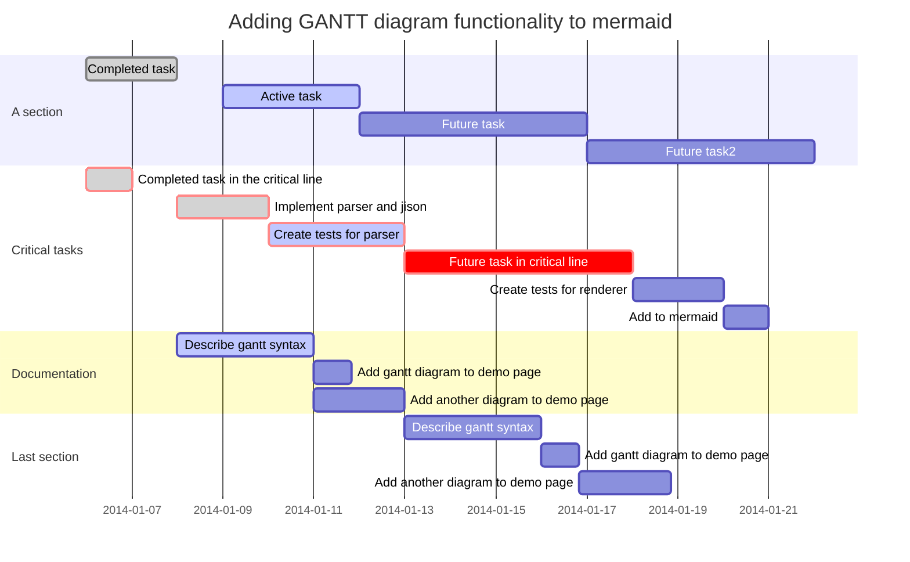

# OX00. 前言

Blog系统其实有很多包括sina、简书等平台Blog系统，也有基于主机自己搭建的Wordpress等CMS系统。知道github后就选用了github的静态站点服务，现在本Blog就是承载在github.io上。

静态站点生成和Blog文章管理，本人接触到的主要是Jekyll和Hexo，Jekyll大概是在两年前用了一段时间，但觉得学习曲线陡峭，同时也发现了Hexo相对友好且容易上手，所以选用了Hexo作为静态网站的管理工具。

网上有很多关于Github的静态站点服务和Hexo教程，本文就不赘述，本文主要记录Markdown及Hexo插件的一些安装和使用小技巧。关于Github静态站点服务和Hexo建议查看官方文档：

Github Page服务：[https://pages.github.com/](https://pages.github.com/)
Hexo Doc：[https://hexo.io/docs/](https://hexo.io/docs/)

# OX01. 关于Markdown

Hexo的所有文章都是使用Markdown作为标记语言生成的，Markdown作为标记语言可以用任何文本编辑工具编辑。在这过程中我使用过很多markdown的编辑器，包括利用插件实现的VIM的版本、Atom的版本，最后还是使用了Typora，很容易上手的一个markdown编辑器。
安装和下载的地址：

##  1. Pandoc
Pandoc插件提供了文档的各种格式的输出功能，如果你需要保存文档至其他格式，包括PDF、Word、Html等等开源格式。
下载和文档地址：[http://www.pandoc.org/](http://www.pandoc.org/)

##  2. Mermaid

Mermaid，本人觉得是Markdown中最牛逼的插件没有之一。以下是实现的一些示例

```sequence
Alice->Bob: Hello Bob, how are you?
Note right of Bob: Bob thinks
Bob-->Alice: I am good thanks!
```

```flow
st=>start: Start
op=>operation: Your Operation
cond=>condition: Yes or No?
e=>end
st->op->cond
cond(yes)->e
cond(no)->op
```
还有复杂的甘特图：


文档地址在：
[https://support.typora.io/Draw-Diagrams-With-Markdown/](https://support.typora.io/Draw-Diagrams-With-Markdown/)

Mermaid的实现满足了工作中大部分需求。

# OX02. 关于Hexo插件
1. Theme
2. 


